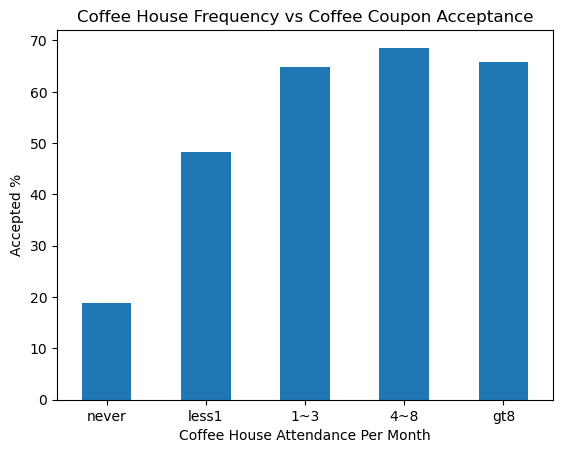
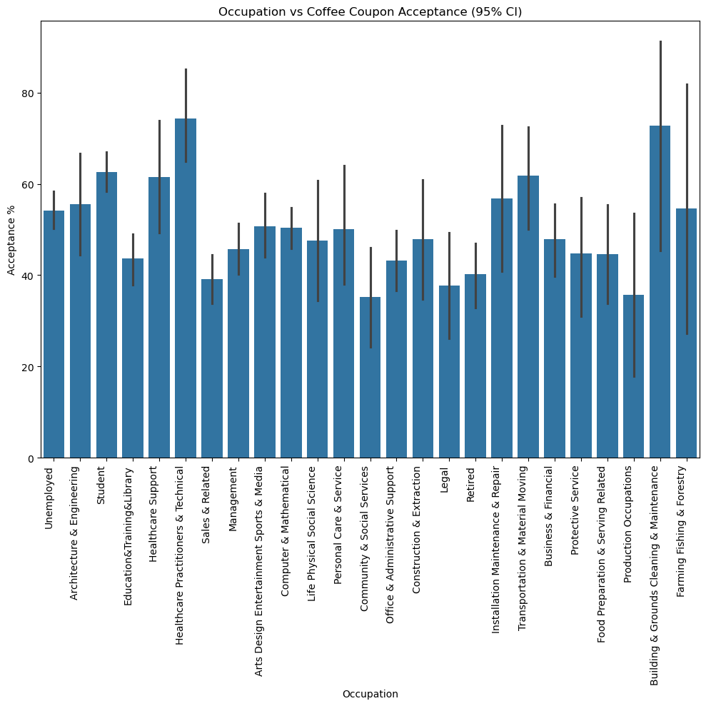
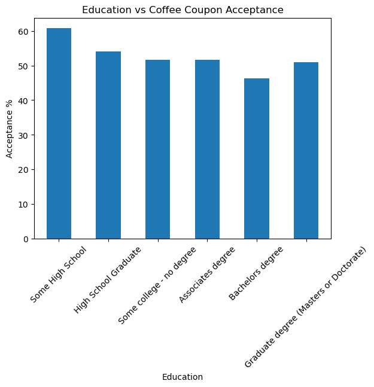
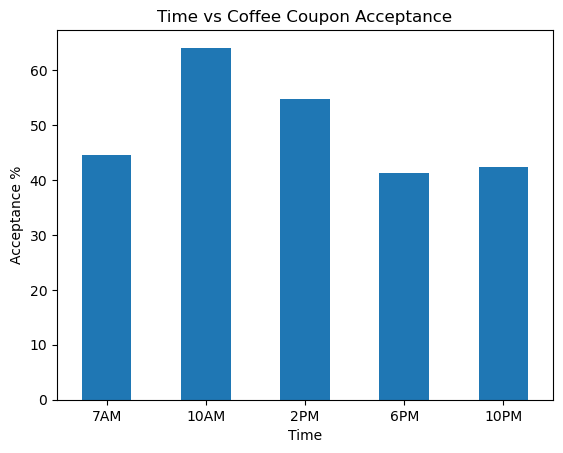
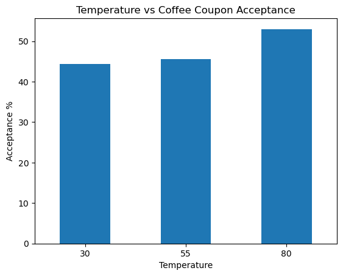
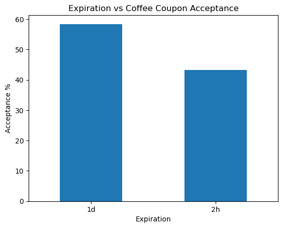

# Coupon Acceptance Analysis

## Coffee House Coupon Findings Summary

Analysis of the data regarding coffee house coupons offered to drivers revealed certain driver demographics, tendencies and trends, enabling better understanding of drivers who are likely to accept coffee house coupons. Coffee house coupons were much more likely to be accepted by very young drivers (those aged 21 and below) and those in specific occupations (Art/Media/Entertainment and Healthcare). As expected, drivers that were already frequently attending coffee shops at least 1 or more times per month were much more likely to accept coupons. Drivers were highly likely to accept coffee house coupons when they didn't have an urgent destination, were with a friend or partner, or were driving during higher outdoor temperatures. They were also more likely to accept coupons during mid morning or early after noon time frames- 10AM to 2PM. Driver's eduation level shows correlation to acceptance rates, as these were observed to be inversely correlated (less education completion was correlated with higher acceptance rates). Driver income largely was not correlated with acceptance rates, neither was marital status. Coupon expiration also impacted driver's willingness to accept, as coupons with more time till expiration dramatically increased acceptance rates.

[View the Jupyter Notebook](analysis.ipynb)

## Recommendations

It would be prudent to assess intersections of these demographic findings to identify statistically high probabilities that a coupon will be accepted, in order to maximize the conversion of coupons offered to coupons accepted. Further surveys could be conducted to better understand what about a coffee shop is most attractive to these drivers (proximity, decor, participation in humanitarian causes, carbon neutral commitments) and include this information on the coupon. Finally, discovering which days of the week are most likely to cause these drivers to attend the coffee shop would be valuable to discover, in order to more accurately target the dispersement of the coupons effectively.

